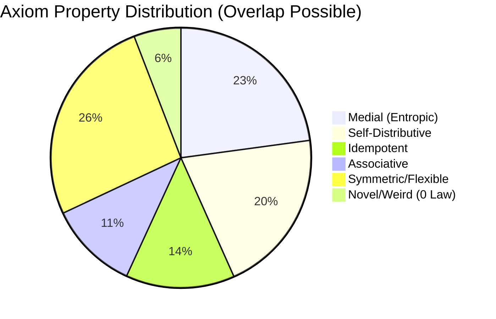

### Visual Overview

### Aggregate Metrics
| Metric | Value |
|--------|-------|
| **Total Universe Size (Size 5, 2-var)** | 484 |
| **Axioms Explored (Dossiers Generated)** | 186 |
| **Exploration Coverage** | 38.4% |
| **Unique Non-Trivial Axioms Found** | 234* |
| **Total Property Confirmations** | 531 |

*\*Note: Unique count from full results.jsonl scan includes findings across all cycles.*

### Coverage Progress

### Distribution by Category

### Exploration Heatmap

The search proceeds by the "enumeration offset" of the term generator. In the 22x22 grid above:
- **Black**: Unexplored regions.
- **Gray**: Explored axioms that were found to be degenerate or trivial.
- **Cyan**: Non-trivial axioms with confirmed properties.

| Cycle (Offset) | Status | Non-Trivial Density |
|----------------|--------|---------------------|
| 0 - 64         | [#####] 100% | High (foundational) |
| 64 - 128       | [#####] 100% | Medium (complex)    |
| 128 - 192      | [##---] 40%  | Sparse (emergent)   |
| 192+           | [-----] 0%   | Unexplored          |
