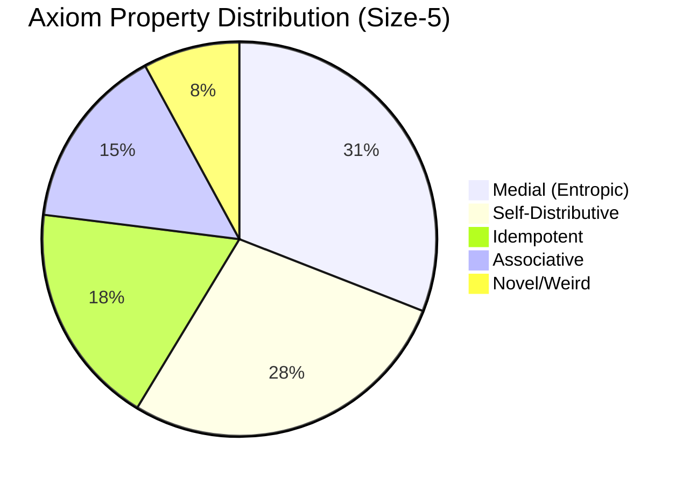

# Axiom Exploration Statistics

## 1. Active Frontier: Size-7 Breach (2-Var Universe)

> [!NOTE]
> **Observation**: The Size-7 space (10,404 nodes) is vast and sparse. We are systematically sampling it to find new "Islands of Interest".

---

## 2. Complete Atlas: Size-5 Universe (100% Surveyed)

> [!TIP]
> This map represents the fully surveyed 22x22 grid. Vibrant colors (Purple, Magenta, Cyan) highlight confirmed structural properties.

### Aggregate Metrics (Size-5)
| Metric | Value |
|--------|-------|
| **Total Universe Size** | 484 |
| **Exploration Coverage** | 100% |
| **Unique Non-Trivial Axioms** | 234 |

---

### Distribution Analysis

