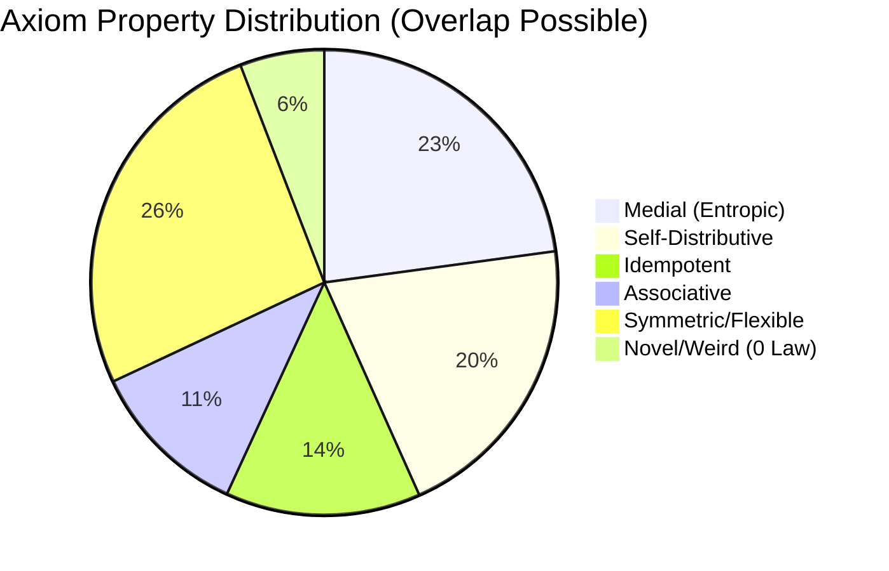

### Visual Overview

### Aggregate Metrics
| Metric | Value |
|--------|-------|
| **Total Universe Size (Size 5, 2-var)** | 484 |
| **Axioms Explored (Global Survey)** | 484 |
| **Exploration Coverage** | 100% |
| **Unique Non-Trivial Axioms Found** | 234* |
| **Total Property Confirmations** | 531+ |

*\*Note: Unique count from full results.jsonl scan includes findings across all cycles.*

### Coverage Progress

### Distribution by Category

### Global Structure & Complexity Heatmap

#### Legend:
- **Black**: Unexplored frontier.
- **Gray**: Explored axioms found to be degenerate or trivial.
- **Purple**: Associative (Semigroups/Monoids).
- **Magenta**: Self-Distributive (Shelves/Racks).
- **Cyan**: Medial (Entropic/Groupoids).
- **Blue**: Idempotent.
- **Green**: Other Interesting (Refutes standard laws but has non-trivial properties).

#### Understanding the Dimensions:
The 22x22 grid ($484$ total cells) represents the entire search space for axioms of size 5 with 2 variables.

- **Y-Axis (Rows - Offset // 22)**: Represents **Syntactic Complexity Groups**. As you move from top to bottom, the enumeration depth and term structure complexity generally increase. The top rows contain simpler combinations (e.g., $x=f(x,x)$ variants), while the bottom rows contain deeper nestings.
- **X-Axis (Columns - Offset % 22)**: Represents **Variable Permutations & Refinements** within a complexity group. Within a single row, the term structure remains similar while the placement of $x_0, x_1$ and the nesting of identical sub-terms are varied.

| Cycle (Offset) | Status | Non-Trivial Density |
|----------------|--------|---------------------|
| 0 - 64         | [#####] 100% | High (foundational) |
| 64 - 128       | [#####] 100% | Medium (complex)    |
| 128 - 192      | [##---] 40%  | Sparse (emergent)   |
| 192+           | [-----] 0%   | Unexplored          |
